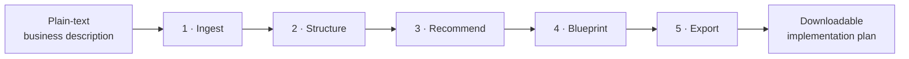
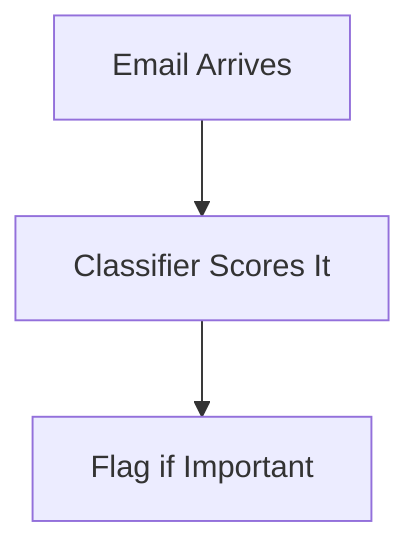

# PARSE

**Business Transformation AI** — describe your business in plain English, get back a concrete implementation plan.

**🔗 Live: [parse-ashen.vercel.app](https://parse-ashen.vercel.app)**

Not a thin wrapper around a chatbot. PARSE runs your input through a five-stage pipeline where each stage has one job, a defined input shape, and a validated output shape — so the AI reasons within a structure instead of free-associating at you.

---

## What it does

Most small businesses know *something* is inefficient. What they usually don't have is the technical vocabulary to describe what an automation solution would even look like, the budget for a consultant to figure it out for them, or anything actionable from generic "AI can help your business!" advice.

PARSE takes a plain-text description of a business and its problems, and turns it into a structured analysis, ranked recommendations, a solution blueprint with an architecture diagram, and a downloadable Markdown document you can hand to a developer.

---

## How it works



**INPUT → UNDERSTAND → RECOMMEND → DESIGN → EXPORT**

| Stage | Endpoint | What it does |
|---|---|---|
| 1 · Ingest | `POST /ingest` | Accepts the raw description, validates there's enough to work with. No AI call. |
| 2 · Structure | `POST /structure` | Extracts industry, pain points, goals, and constraints into a consistent schema. |
| 3 · Recommend | `POST /recommend` | Generates ranked recommendations — each one required to cite a specific pain point or goal it addresses. |
| 4 · Blueprint | `POST /solution` | Turns a chosen recommendation into components, a workflow, and a Mermaid architecture diagram. |
| 5 · Export | `POST /export` | Assembles everything into a downloadable Markdown document. |

Each stage validates its input and output against a Pydantic model, so a malformed LLM response fails immediately and visibly — at the stage that produced it — rather than quietly corrupting something three steps later. This is the actual differentiator: the business logic (what counts as a valid recommendation, what a blueprint must contain) is enforced in code, not left to a prompt's good behavior.

---

## Example

**Input:**
> "I am running a law firm but I have a problem with sorting emails, my team wastes time reading the non-important emails which leads to missing out on the important ones."

**Stage 2 — structured:**
```json
{
  "industry": "law firm",
  "pain_points": ["team wastes time reading non-important emails", "important emails get missed"],
  "goals": ["sort emails efficiently"],
  "constraints": ["small team"]
}
```

**Stage 3 — recommended:**
```json
{
  "title": "AI Email Triage System",
  "addresses": "team wastes time reading non-important emails",
  "reasoning": "Automatically flags high-priority emails so the team can focus attention correctly.",
  "priority": "high"
}
```

**Stage 4 — designed:**


**Stage 5 — exported** as a formatted `.md` file, ready to open, share, or hand off.

---

## Stack

- **Python + FastAPI** — endpoints, request/response handling
- **Pydantic** — schema definitions and validation at every stage boundary
- **Gemini** (`gemini-3.6-flash`) — the LLM behind stages 2, 3, and 4
- **Plain HTML/CSS/JS** — no framework; GSAP for the pipeline reveal animation, Mermaid (lazy-loaded) for diagram rendering
- **Vercel** — single deployment, same origin for frontend and API (no CORS needed)

---

## Running it locally

**Requires:** Python 3.10+ and a Gemini API key ([Google AI Studio](https://aistudio.google.com), free tier works).

```bash
git clone https://github.com/rudrapatel-1368/PARSE.git
cd PARSE
pip install -r requirements.txt
```

Create a `.env` file in the project root:
```
GEMINI_API_KEY=your_key_here
```

Start the server:
```bash
python -m uvicorn main:app --reload
```

Open **http://127.0.0.1:8000** for the site, or **http://127.0.0.1:8000/docs** for FastAPI's auto-generated API explorer — run every endpoint and see real responses without touching the frontend.

---

## License

No license file yet — all rights reserved by default. Open an issue if you want to use this and I'll sort out a license.
